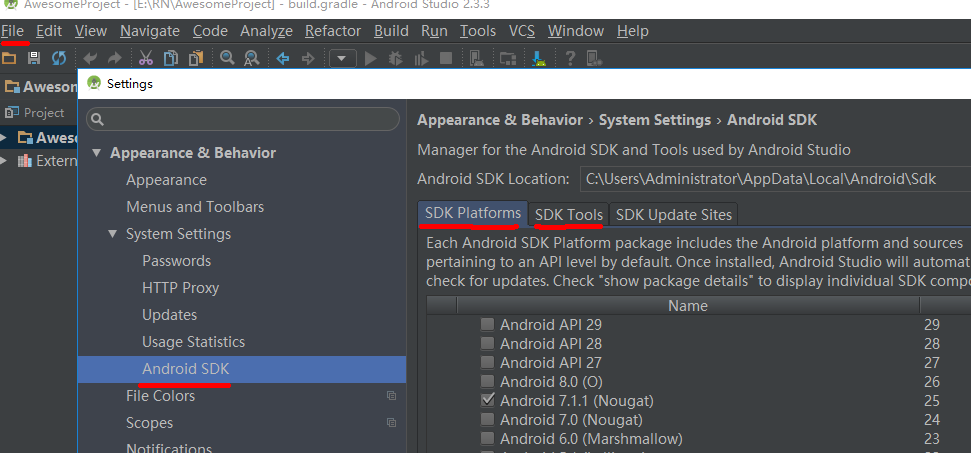
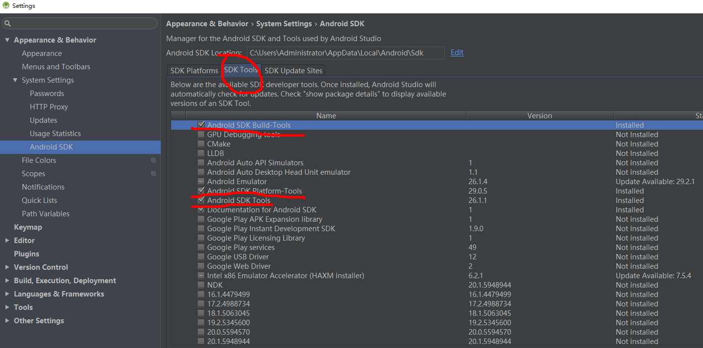

# Appium 文档  

## 简介  

Appium 支持 Android 和 IOS 自动化测试。  

## 环境搭建  

### JDK  

官网下载 JDK 安装后，配置如下：

1. JAVA_HOME  

如果系统变量中没有，在里面添加 JAVA_HOME，填写 JDK 安装目录。  

```text
C:\Program Files\Java\jdk1.8.0_151
```

2. classpath  

```text
.;%JAVA_HOME%\lib;%JAVA_HOME%\lib\tools.jar
```  

3. path  

```text  
%JAVA_HOME%\bin
%JAVA_HOME%\jre\bin  
```  

验证方法：  

* 桌面"win+R"，输入"cmd",在 cmd 中输入"java -version",返回版本号  

* 在 cmd 中输入"java",返回用法列表  

* 在 cmd 中输入"javac"，返回用法列表  

### 安装node.js  

由于 Appium 的 server 端是 nodejs 编写的，所以需要安装 nodejs。去官方网站下载 nodejs 即可，然后一键安装。  

cmd 中输入"node -v",返回版本号为安装成功过。(文档中 node 版本 v10.16.0)  

### 安装Android SDK  

直接下载 android studio 后，直接在该 IDE 里选择下载相应版本即可。  

进入待下载位置：  

  

勾选 SDK Tools 下面的 Android SDK Platform-tools 和 Android SDK Build-tools，Android SDK Tools，Google USB Driver

  

勾选后点击右下角的 Apply 自动下载安装即可。  

配置：  

1.path  

```text  
C:\Users\Administrator\AppData\Local\Android\sdk
C:\Users\Administrator\AppData\Local\Android\sdk\tools
C:\Users\Administrator\AppData\Local\Android\sdk\platform-tools
C:\Users\Administrator\AppData\Local\Android\sdk\build-tools\29.0.2
```  

验证方法：在 cmd 中输入下列命令即可。  

```text
adb            验证 platform-tools 是否配置成功  
aapt           验证 build-tools 是否配置成功  
monkeyrunner   验证 tools 是否配置成功(需要在C:\Users\Administrator\AppData\Local\Android\sdk\tools\bin目录下验证)  
```  

### 安装Appium-Server  

使用 appium-desktop 来搭建 Appium-Server 环境，appium-desktop 是连接 appium 服务的桌面应用，可以方便测试人员进行连接手机，录制脚本等工作。  

安装方法：  

1.去 github 下载(https://github.com/appium/appium-desktop/releases)  

appium 安装好后,找到这个文件安装目录 *\.bin,将上面的地址添加到环境变量 path 下

检查 appium 所有需求环境  

```text
cmd  npm install -g appium-doctor  
appium-doctor     验证环境是否OK
```  


